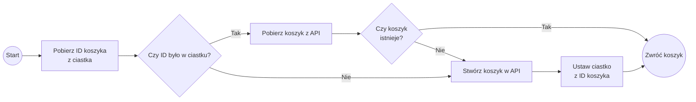

### Dobra, dawaj ten koszyk

Ok, ok, już. Podzielimy proces dodawania przedmiotu do koszyka na dwa logiczne etapy:

1. Pobierz istniejący lub stwórz nowy koszyk.
2. Dodaj przedmiot do tego koszyka.

Kod naszej akcji wygląda tak:

``` tsx
async function addProductToCartAction() {
	"use server";
	const cart = await getOrCreateCart();
	await addProductToCart(cart.id, product.id);
}

```

Przejdźmy do implementacji poszczególnych części. ID koszyka będziemy przechowywać w ciastkach, a w tym celu musimy poznać nowe API udostępniane przez Next.js służące do operowania na między innymi na Cookies: `next/headers`. Cały kod będzie wyglądał tak:

``` tsx
import { cookies } from "next/headers";

// …

async function getOrCreateCart() {
	const cartId = cookies().get("cartId")?.value;
	if (cartId) {
		const { order: cart } = await executeGraphql(CartGetByIdDocument, {
			id: cartId,
		});
		if (cart) {
			return cart;
		}
	}

	const { createOrder: newCart } = await executeGraphql(CartCreateDocument);
	if (!newCart) {
		throw new Error("Failed to create cart");
	}

	cookies().set("cartId", newCart.id);
	return newCart;
}

```

Kompletny kod mutacji znajdziesz pod koniec tej sekcji. Dzieje się tu sporo, choć w sumie proces jest raczej prosty. W zrozumieniu go może pomóc poniższy diagram:



⚠️ **Uwaga**: Twój kod może się różnić od powyższego jeśli korzystasz z innego backendu GraphQL lub budujesz go sam(a).

Funkcja `cookies()` udostępnia nam spójny interfejs dostępu do ciastek. Bazuje on na [szkicu propozycji do standardu o nazwie `CookieStore`](https://wicg.github.io/cookie-store/). W _Server Actions_ możemy ciastka odczytywać i zapisywać, a w _Server Components_ tylko odczytywać. Służą temu metody `get` i `set`:

``` ts
cookies().get("nazwa"); // RequestCookie | undefined
cookies().set("nazwa", "wartość"). // ResponseCookies
```

Do `set` możemy też przekazać szereg opcji związanych z ciastkami:

```ts
cookies().set("nazwa", "1", {
	maxAge: 60 * 60 * 24 * 365,
	expires: new Date(Date.now() + 1000 * 60 * 60 * 24 * 365),
	path: "/",
	domain: "example.com",
	httpOnly: true,
	secure: true,
	sameSite: "lax",
	priority: "low",
});

```

Skoro mamy już koszyk, to nie pozostaje nam nic innego, jak spróbować coś do niego dodać.

```tsx
async function addProductToCart(cartId: string, productId: string) {
	const { product } = await executeGraphql(ProductGetByIdDocument, {
		id: productId,
	});
	if (!product) {
		throw new Error(`Product with id ${productId} not found`);
	}

	await executeGraphql(CartAddItemDocument, {
		cartId,
		productId,
		total: product.price,
	});
}

```