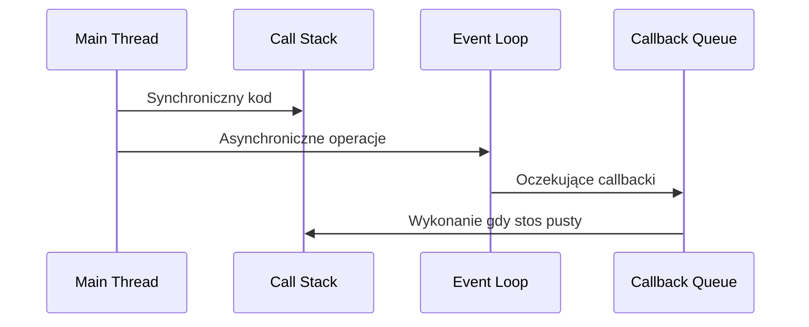

## Wprowadzenie

Często zdarza się, że aplikacja frontendowa będzie pobierać niezbędne dane z wielu różnych źródeł. O ile w mniejszych projektach takim źródłem będzie pojedyncze API, to w dużym zespole serwisów backendowych może być dwa lub więcej.

Jak w takich sytuacjach poradzić sobie z kontrolą asynchroniczności?

## Asynchroniczność

Mechanizm pozwalający na wykonywanie kodu bez blokowania głównego wątku (non-blocking).



## Metody obiektu Promise

JavaScript dostarcza szereg wbudowanych metod w obiekt Promise, które pozwalają zarządzać wieloma asynchronicznymi operacjami. W tym podrozdziale omówimy najważniejsze z tych metod, w tym:

- Promise.any
- Promise.all
- Promise.allSettled
- Promise.race
- Metody pomocnicze Promise.resolve i Promise.reject

### Promise.any

_Promise.any_ ==pozwala na wykonanie wielu równoległych zapytań i pobranie wyników tego, które ukończyło się w najkrótszym czasie==.

Ta funkcja może być przydatna wtedy, kiedy tę samą porcję danych zwracają dwa lub więcej serwisów, a nam zależy na uzyskaniu odpowiedzi z dowolnego z nich, przy jednoczesnym zabezpieczeniu na ewentualne awarie lub niedostępność danych.

Promise zostanie odrzucony kiedy wszystkie przekazane funkcje zwrócą błąd.

```typescript
const articlesPrimary = fetch('https://api.primary.com/articles');
const articlesSecondary = fetch('https://api.secondary.com/articles');

Promise.any([articlesPrimary, articlesSecondary])
  .then(response => response.json())
  .then(data => {
    // Źródło artykułów jest od teraz nieistotne
    console.log('Artykuły:', data);
  })
  .catch(error => {
    // Dwa zapytania ukończone błędem
    console.error('Wystąpił błąd:', error);
  });
```

### Promise.all

_Promise.all_, podobnie jak _Promise.any_, ==pomoże nam wykonać kilka równoległych zapytań, ale tutaj Promise zostanie rozwiązany z tablicą wszystkich wyników, a nie jednym z nich.==

Plusem tej metody jest łatwe synchronizowanie wielu zapytań i wykonanie dalszej części kodu wtedy, kiedy całość rozproszonych danych znajdzie się po stronie klienta. Znaczącym minusem jest zależność czasowa na najwolniejsze z zapytań - jeśli na trzy zapytania dwa są ukończone w sekundę, a na trzecie czekamy dziesięć sekund, _Promise.all_ zostanie rozwiązany dopiero po dziesięciu sekundach.

==Obsługa błędów sprowadza się do wyniku każdego z zapytań - jeśli dowolne zostanie odrzucone, wtedy całość _Promise.all_ jest również odrzucana==.

```typescript
const configData = fetch('https://api.example.com/config');
const userData = fetch('https://api.example.com/user');
const appData = fetch('https://api.example.com/appData');

Promise.all([configData, userData, appData])
  .then(responses => Promise.all(responses.map(response => response.json())))
  .then(([config, user, app]) => {
    // Inicjalizacja aplikacji z pobranymi danymi
  })
  .catch(error => {
    // Obsługa błędów
  });
```

### Promise.allSettled

_Promise.allSettled_ działa podobnie do _Promise.all_, ale ==zwraca wyniki wszystkich promise’ów, niezależnie od tego, czy zostały rozwiązane, czy odrzucone. Każdy wynik zawiera status oraz wartość lub powód odrzucenia==.

```typescript
const userData = fetch('https://api.example.com/user');
const configData = fetch('https://api.example.com/config');

Promise.allSettled([userData, configData])
  .then(results => {
    results.forEach(result => {
      if (result.status === 'fulfilled') {
        console.log('Dane:', result.value);
      } else {
        console.error('Błąd:', result.reason);
      }
    });
  });
```

W przypadku ==_Promise.allSettled_ na całość operacji wpłynie czas najwolniejszego z wszystkich zapytań, co również może powodować nieoczekiwane problemy z wydajnością aplikacji (np. blokowanie pierwszego ładowania danych)==.

### Promise.race

_Promise.race_ ==uruchamia “wyścig” dwóch funkcji, które zwracają promise. W przypadku zapytań, które muszą być ograniczone czasowo, aby zapewnić dobrą responsywność aplikacji,== _Promise.race_ jest idealnym rozwiązaniem. Można użyć go do stworzenia opisywanego wcześniej mechanizmu timeoutu, gdzie zapytanie API musi zakończyć się w określonym czasie. W przeciwnym razie zostanie odrzucone i aplikacja będzie mogła podjąć inne działania.

```typescript
const fetchData = fetch('https://api.example.com/data');
const timeout = new Promise((_, reject) => setTimeout(() => reject(new Error('Timeout')), 5000));

Promise.race([fetchData, timeout])
  .then(response => response.json())
  .then(data => {
    // Przetwarzanie danych
  })
  .catch(error => {
    // Obsługa błędów, np. pokazanie komunikatu o przekroczeniu czasu
  });
```

### Promise.resolve i Promise.reject

Czasami zdarza się, że obok zestawu asynchronicznych zapytań mamy statyczne dane, które chcielibyśmy przetwarzać w bardziej spójny sposób. W tym wypadku możemy się zdecydować. na _Promise.resolve_ i _Promise.reject_ czyli funkcje, które tworzą poprawny lub odrzucony promise z konkretną wartością.

```typescript
// Statyczne dane konfiguracyjne aplikacji (np. w osobnym module lub wyrenderowane server-side)
const appConfig = {
  theme: 'dark',
  language: 'pl',
  version: '1.0.0'
};

// Dopasowanie konfiguracji do procesowania asynchronicznego
const configPromise = Promise.resolve(appConfig);

// Asynchroniczne zapytanie do API
const fetchUserData = fetch('https://api.example.com/user');

Promise.all([configPromise, fetchUserData])
  .then(responses => {
    const [config, userResponse] = responses;
    return Promise.all([config, userResponse.json()]);
  })
  .then(([config, userData]) => {
    // Przetwarzanie wszystkich danych
    appBootstrap(config, userData);
  })
  .catch(error => {
    console.error('Wystąpił błąd:', error);
  });
```

Obie metody są też często wykorzystywane w testach serwisów, które możemy zastąpić poprzez symulowane wartości odpowiedzi.

## Podsumowanie

Wykorzystanie metod obiektu Promise pozwoli ci kontrolować równoległe, asynchroniczne zapytania do twojego API.

Większa kontrola nad komunikacją client-side to lepsze doświadczenia dla użytkownika, którego przeglądarka będzie mogła pobierać dane w optymalny sposób.

Pamiętaj o przedstawionych tutaj metodach kiedy w twojej aplikacji zaczynają się pojawiać bardziej złożone scenariusze, wielokrotne zapytania i zróżnicowane czasy oczekiwania na odpowiedź.