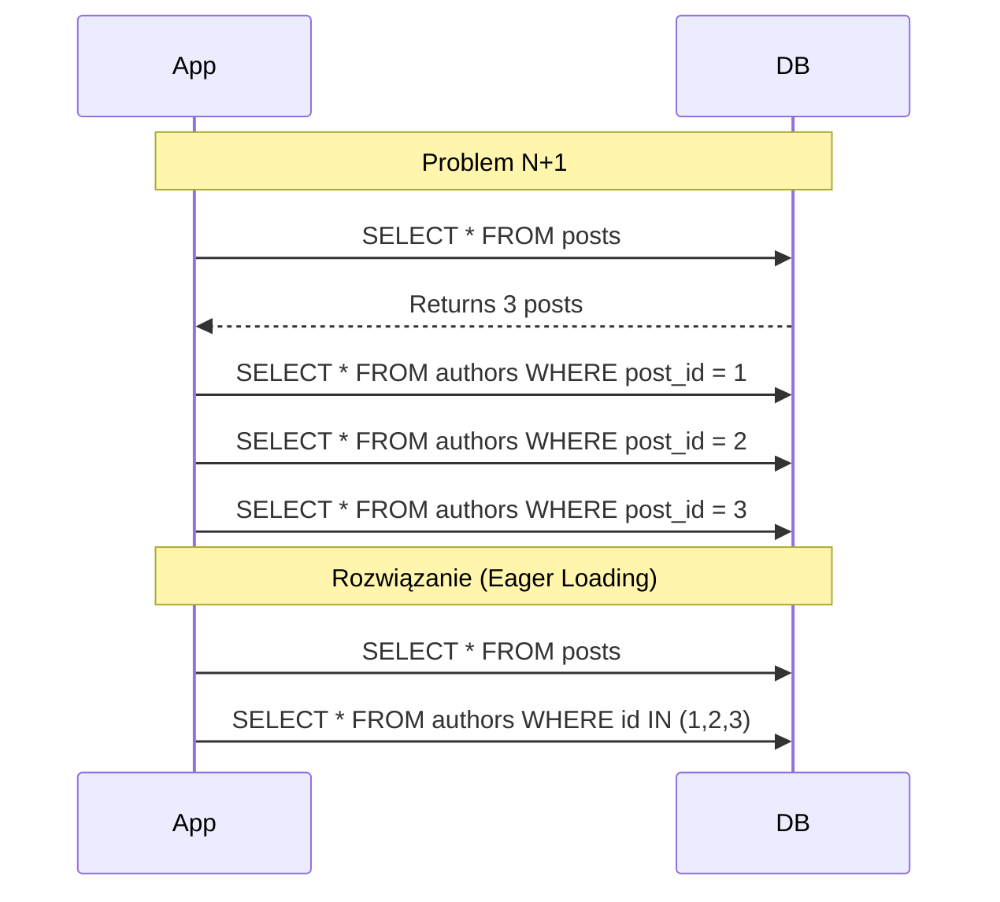

# Problem N+1


## Definicja

- Problem wydajnościowy w zapytaniach bazodanowych
- N+1 = 1 (główne zapytanie) + N (zapytań dla każdego rekordu)

## Gdzie występuje
- ORM
- GraphQL
- REST API
- Relacje bazodanowe
### Opis

Problem N+1 to klasyczny problem wydajnościowy w programowaniu, szczególnie widoczny przy operacjach na bazach danych. Nazwa "N+1" odnosi się do liczby zapytań do bazy danych, gdzie:
- 1 to pierwsze zapytanie pobierające listę głównych rekordów
- N to liczba dodatkowych zapytań wykonywanych dla każdego z pobranych rekordów

Przykład problemu N+1:

```ts
// Pierwsze zapytanie (1)
$posts = Post::all(); // SELECT * FROM posts;


// Dla każdego posta wykonujemy dodatkowe zapytanie (N)
foreach ($posts as $post) {
    $author = $post->author; // SELECT * FROM authors WHERE id = ?
}
```

Jeśli mamy 100 postów, wykonamy:
- 1 zapytanie na pobranie postów
- 100 zapytań na pobranie autorów
- Łącznie: 101 zapytań!


### Rozwiazanie - Early Loading

```ts
// Jedno zapytanie z JOIN

$posts = Post::with('author')->get();

// SELECT * FROM posts;
// SELECT * FROM authors WHERE id IN (1,2,3...);
```

Teraz mamy tylko 2 zapytania zamiast 101!

